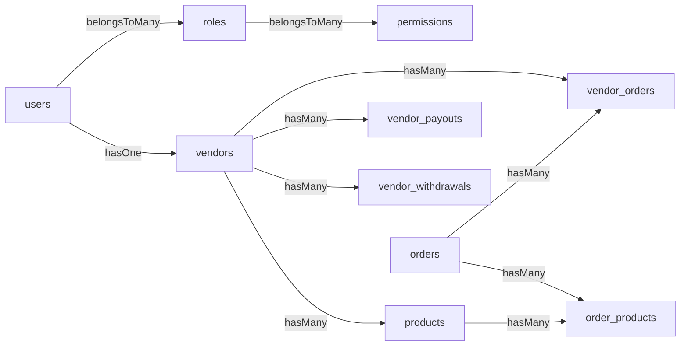

# Developer Tutorial — From Zero to a Live Multi-Vendor Marketplace

A self-paced course that takes you from `git clone` to a production-ready, multi-vendor e-commerce platform that real customers can use. Built around Laravel 12, this tutorial is equally useful as a **setup guide**, a **codebase tour**, and an **admin operator's handbook**.

> **Who this is for**
> - Backend / full-stack developers who know PHP and the command line.
> - You do *not* need prior Laravel experience — every Laravel-specific concept is introduced as we go.
> - Linux is assumed for the production parts. Local dev works on Linux, macOS, and Windows (via WSL2).

> **How to read this tutorial**
> - **Need to ship today?** Read [§2 Quick start](#2-quick-start). You'll have a working install in ~5 minutes.
> - **New to the project?** Read [Part I — Concepts & architecture](#part-i--concepts--architecture) first. The codebase makes far more sense once you understand the *why*.
> - **Adding a feature?** Skip to [Part III — Codebase tour](#part-iii--codebase-tour) and then [Lesson 9 — Add a new admin CRUD module](#lesson-9--add-a-new-admin-crud-module).
> - **Going to production?** Jump to [Part V — Going to production](#part-v--going-to-production).

---

## Table of contents

**Part I — Concepts & architecture**
1. [What this project is](#1-what-this-project-is)
2. [Quick start](#2-quick-start)
3. [The three actor tiers](#3-the-three-actor-tiers)
4. [Request lifecycle](#4-request-lifecycle)
5. [Database map](#5-database-map)
6. [Code map](#6-code-map)

**Part II — Local setup in depth**
7. [Prerequisites](#7-prerequisites)
8. [Clone & install](#8-clone--install)
9. [The `.env` file explained](#9-the-env-file-explained)
10. [Migrations & seeders, explained](#10-migrations--seeders-explained)
11. [Front-end assets (Vite)](#11-front-end-assets-vite)
12. [Start the dev server & verify](#12-start-the-dev-server--verify)

**Part III — Codebase tour**
13. [File layout & naming conventions](#13-file-layout--naming-conventions)
14. [The `BaseController` pattern](#14-the-basecontroller-pattern)
15. [The permission system end to end](#15-the-permission-system-end-to-end)
16. [The `HasTranslations` trait](#16-the-hastranslations-trait)
17. [Polymorphic media (`entity_media`)](#17-polymorphic-media-entity_media)
18. [Vendor isolation](#18-vendor-isolation)

**Part IV — Hands-on lessons**
- [Lesson 1 — First admin login & UI tour](#lesson-1--first-admin-login--ui-tour)
- [Lesson 2 — Build the catalogue (brands → categories → taxes → products)](#lesson-2--build-the-catalogue)
- [Lesson 3 — Onboard your first vendor](#lesson-3--onboard-your-first-vendor)
- [Lesson 4 — Place an order end to end](#lesson-4--place-an-order-end-to-end)
- [Lesson 5 — Vendor payouts & withdrawals](#lesson-5--vendor-payouts--withdrawals)
- [Lesson 6 — Multi-language content (English ↔ Khmer)](#lesson-6--multi-language-content-english--khmer)
- [Lesson 7 — Custom role & permission gating](#lesson-7--custom-role--permission-gating)
- [Lesson 8 — Inventory: warehouses → POs → stock takes](#lesson-8--inventory-warehouses--pos--stock-takes)
- [Lesson 9 — Add a new admin CRUD module](#lesson-9--add-a-new-admin-crud-module)
- [Lesson 10 — Writing tests for your module](#lesson-10--writing-tests-for-your-module)

**Part V — Going to production**
- [19. Server requirements](#19-server-requirements)
- [20. Deploy steps (first deploy)](#20-deploy-steps-first-deploy)
- [21. Nginx + PHP-FPM](#21-nginx--php-fpm)
- [22. Queue worker (Supervisor)](#22-queue-worker-supervisor)
- [23. Cron / scheduled tasks](#23-cron--scheduled-tasks)
- [24. Pre-launch checklist](#24-pre-launch-checklist)

**Part VI — Day-2 operations**
- [25. Deploying updates](#25-deploying-updates)
- [26. Logs](#26-logs)
- [27. Database backups](#27-database-backups)
- [28. Clearing caches](#28-clearing-caches)
- [29. Running the test suite](#29-running-the-test-suite)

**Part VII — Troubleshooting cheatsheet**
- [30. Troubleshooting cheatsheet](#30-troubleshooting-cheatsheet)

**Part VIII — Reference**
- [31. Glossary](#31-glossary)
- [32. Where to go next](#32-where-to-go-next)

---

# Part I — Concepts & architecture

## 1. What this project is

This is a **Laravel 12 multi-vendor e-commerce backend** (inspired by FleetCart). It is the administrative side of a marketplace where:

- A **platform operator** (you) owns the system.
- Multiple **vendors** register and sell their own products through your storefront.
- **Customers** browse, place orders, and pay; orders are then split per-vendor for fulfilment and commission accounting.

You are *not* shipping a finished SaaS — you are shipping a foundation. Out of the box you get:

| Capability                         | Status |
| ---------------------------------- | ------ |
| Admin RBAC (roles + 432 permissions) | Done |
| Vendor onboarding + approval        | Done |
| Product catalogue + variations      | Done |
| Multi-language content (any locale) | Done |
| Polymorphic media library           | Done |
| Tax classes + per-region rates      | Done |
| Order processing + status workflow  | Done |
| Vendor commission + payouts         | Done |
| Vendor withdrawal requests          | Done |
| Inventory: warehouses, POs, stocks  | Done |
| Coupons & flash sales               | Done |
| Blog / CMS pages                    | Done |
| Settings UI (mail, payment, SEO …)  | Done |

What you build on top: storefront views, payment gateway integrations beyond what's seeded, custom reports, your business logic.

> **Mental model:** treat this repo as a *headless* admin platform plus a Blade-rendered control panel. The storefront wiring exists but the visual layer is intentionally minimal so you can rebuild it for your brand.

[↑ Top](#table-of-contents)

---

## 2. Quick start

If you just want a running install on SQLite for evaluation, this is the entire flow:

```bash
git clone https://github.com/oudampanha/laravel12-multivendor-fleetcart.git
cd laravel12-multivendor-fleetcart

composer install
npm install

cp .env.example .env
php artisan key:generate

mkdir -p database && touch database/database.sqlite

php artisan migrate:fresh --seed --force
npm run build

php artisan serve --host 127.0.0.1 --port 8000
```

Open <http://127.0.0.1:8000/admin> and sign in:

| Field    | Value                  |
| -------- | ---------------------- |
| Email    | `superadmin@gmail.com` |
| Password | `12345678`             |

> **Reality check** — what success looks like at each step:
> - `composer install` → ends with *"Generating optimized autoload files"* and no red text.
> - `npm install` → ends with `added <N> packages` and no `npm error`.
> - `php artisan key:generate` → prints `INFO  Application key set successfully.`
> - `migrate:fresh --seed --force` → ends with the seeder list and `INFO  Database seeded.`; no `SQLSTATE[...]` errors.
> - `npm run build` → ends with `vite vX.Y.Z building for production...` then `✓ built in Xs`.
> - `php artisan serve` → prints `INFO  Server running on [http://127.0.0.1:8000]`.

If any of those don't match, jump to [§30 Troubleshooting cheatsheet](#30-troubleshooting-cheatsheet) — every common failure is listed there with a fix.

[↑ Top](#table-of-contents)

---

## 3. The three actor tiers

The application is built around three actor tiers. Every feature, route, and permission belongs to one of them.

| Tier          | Who                                | Lives in                                       | Sample permissions                                  |
| ------------- | ---------------------------------- | ---------------------------------------------- | --------------------------------------------------- |
| **Platform**  | You (super-admin), platform staff  | `users` (with admin role)                      | `dashboard_access`, `user_management_access`        |
| **Vendor**    | Merchant accounts                  | `users` + matching `vendors` row               | `product_create`, `vendor_order_access`             |
| **Customer**  | End shoppers                       | `users` (no admin role)                        | none — they use the storefront, not `/admin`        |

A single `users` row carries the identity for any tier; what they can do is determined entirely by the **roles** assigned to them, which in turn carry **permissions**. See [§15 The permission system end to end](#15-the-permission-system-end-to-end).



[↑ Top](#table-of-contents)

---

## 4. Request lifecycle

What actually happens when a logged-in admin opens `/admin/products`?

```
HTTP GET /admin/products
        │
        ▼
public/index.php                       ← entry point
        │
        ▼
bootstrap/app.php → kernel             ← Laravel boots
        │
        ▼
Route::middleware(['auth', 'permission:dashboard_access'])
    ->prefix('admin')
    ->group(... routes/admin.php ...)  ← routes/admin.php
        │
        ▼
Auth middleware                        ← are you logged in?
PermissionMiddleware                   ← do you have dashboard_access?
        │
        ▼
ProductController extends BaseController
    constructor → applyResourcePermissions()
    middleware('permission:product_access')->only(['index','show'])
        │
        ▼
ProductController@index                ← business logic
        │
        ▼
view('admin.products.index', $data)    ← Blade view
        │
        ▼
resources/views/admin/products/index.blade.php
    @vite([...])                       ← pulls compiled JS/CSS
    @permission('product_create') ...  ← view-level RBAC
        │
        ▼
HTTP 200 OK + HTML
```

Three observations that will save you hours later:

1. **Every admin controller extends `BaseController`** and declares `protected string $resource = 'foo';`. CRUD permission middleware is wired automatically — see [§14](#14-the-basecontroller-pattern).
2. **Routes are kebab-case**, views are kebab-case directories (`admin/blog-categories/index.blade.php`). Snake-case view paths break with "View not found" — a class of bug we fixed across 34 controllers in [PR #17](https://github.com/oudampanha/laravel12-multivendor-fleetcart/pull/17).
3. **Front-end assets are required**: without `npm run build` the `@vite([...])` directive throws `ViteManifestNotFoundException` and every view-rendering route 500s.

[↑ Top](#table-of-contents)

---

## 5. Database map

103 tables, organised into 9 logical clusters. Knowing where a feature lives makes Tinker and SQL queries much faster.

```
┌──────────────────────────┐
│ Identity & access (RBAC) │  users, roles, permissions,
│                          │  permission_role, role_user, otp_verifications,
│                          │  persistences, activations, reminders, throttle
└──────────────────────────┘
┌──────────────────────────┐
│ Vendor & commerce        │  vendors, vendor_settings, vendor_shipping_zones,
│                          │  vendor_reviews, vendor_notifications
└──────────────────────────┘
┌──────────────────────────┐
│ Catalogue                │  products, product_categories, product_attributes,
│                          │  product_variants, variations, variation_values,
│                          │  options, option_values, brands, categories, tags,
│                          │  attribute_sets, attributes, attribute_values,
│                          │  related_products, up_sell_products, cross_sell_products
└──────────────────────────┘
┌──────────────────────────┐
│ Pricing & promotion      │  tax_classes, tax_rates, coupons, coupon_products,
│                          │  flash_sales, flash_sale_products, currency_rates
└──────────────────────────┘
┌──────────────────────────┐
│ Order processing         │  orders, order_products, order_product_options,
│                          │  order_product_variations, order_downloads,
│                          │  vendor_orders, carts, wish_lists, search_terms,
│                          │  transactions
└──────────────────────────┘
┌──────────────────────────┐
│ Money out                │  vendor_payouts, vendor_withdrawals
└──────────────────────────┘
┌──────────────────────────┐
│ Content & i18n           │  blog_posts, blog_categories, blog_tags,
│                          │  pages, menus, menu_items, sliders, slider_slides,
│                          │  reviews, translations, language_lines, meta_data
└──────────────────────────┘
┌──────────────────────────┐
│ Media                    │  media, entity_media          ← polymorphic
└──────────────────────────┘
┌──────────────────────────┐
│ Inventory (14 tables)    │  warehouses, suppliers,
│                          │  purchase_orders, purchase_order_items,
│                          │  goods_receipts, goods_receipt_items,
│                          │  stock_takes, stock_take_items,
│                          │  stock_transfers, stock_transfer_items,
│                          │  stock_adjustments, stock_movements,
│                          │  product_stocks, settings
└──────────────────────────┘
```

The two consolidated migrations are:

- [`database/migrations/2025_09_07_170807_create_laravel_multivendor_table.php`](database/migrations/2025_09_07_170807_create_laravel_multivendor_table.php) — 80 tables (clusters 1–7 and Media).
- [`database/migrations/2026_05_20_000000_create_stock_management_tables.php`](database/migrations/2026_05_20_000000_create_stock_management_tables.php) — 14 inventory tables.

Plus 9 framework tables (sessions, jobs, cache, Breeze auth scaffolding).

> **Tip.** When you don't remember a column, ask SQLite directly:
> ```bash
> sqlite3 database/database.sqlite ".schema products" | less
> ```
> Or in Tinker:
> ```php
> >>> \Schema::getColumnListing('entity_media');
> => ["id","file_id","entity_type","entity_id","zone","created_at","updated_at"]
> ```

[↑ Top](#table-of-contents)

---

## 6. Code map

```
laravel12-multivendor-fleetcart/
├── app/
│   ├── Http/
│   │   ├── Controllers/
│   │   │   ├── Backend/                ← every admin controller (50+)
│   │   │   │   ├── BaseController.php  ← parent for all admin controllers
│   │   │   │   ├── ProductController.php
│   │   │   │   ├── OrderController.php
│   │   │   │   ├── VendorController.php
│   │   │   │   └── ...
│   │   │   └── Auth/                   ← Laravel Breeze auth scaffolding
│   │   └── Middleware/
│   │       └── PermissionMiddleware.php
│   ├── Models/                         ← Eloquent models (one per table)
│   └── Traits/
│       ├── HasPermissions.php          ← used by User
│       ├── HasTranslations.php         ← used by Product, Category, …
│       ├── HasMedia.php
│       ├── HasMetaData.php
│       └── ImageUploadTrait.php
│
├── database/
│   ├── migrations/                     ← 2 consolidated + 9 framework
│   └── seeders/                        ← 96 per-table seeders + DatabaseSeeder
│
├── resources/views/
│   ├── admin/                          ← kebab-case dirs: blog-categories/, ...
│   │   ├── layouts/                    ← shared admin chrome
│   │   ├── products/
│   │   ├── orders/
│   │   └── ...
│   ├── components/                     ← Blade components (x-media-selector, …)
│   └── auth/                           ← Breeze
│
├── routes/
│   ├── admin.php                       ← ALL admin routes (~650 entries)
│   ├── auth.php                        ← login / register / forgot password
│   ├── web.php                         ← storefront routes
│   └── console.php                     ← scheduled tasks
│
├── public/
│   ├── index.php                       ← entry point
│   └── build/manifest.json             ← created by `npm run build`
│
├── storage/
│   ├── app/public/                     ← uploaded media (symlinked to /storage)
│   ├── logs/laravel.log
│   └── framework/                      ← cache, sessions, views
│
├── tests/
│   ├── Feature/
│   └── Unit/
│
├── CLAUDE.md                           ← conventions (file paths, naming)
├── README.md
├── TUTORIAL.md                         ← you are here
├── CONTROLLER_PERMISSIONS.md           ← full permission catalogue
├── PERMISSION_USAGE.md
├── TRANSLATION_SYSTEM_GUIDE.md
├── CRUD_PATTERN_DOCUMENTATION.md
└── composer.json / package.json
```

Every new piece of code lands in one of those existing folders. The only times you'll create a new directory are: a new Blade component group (`resources/views/components/<group>/`) or a new view folder for a new resource (`resources/views/admin/<resource>/`).

> **Naming gotcha.** Routes & view directories use **kebab-case** (`/admin/blog-categories`, `admin.blog-categories.index`), but **table names**, **model traits**, and **seeder filenames** use **snake_case** (`blog_categories`, `BlogCategoriesTableSeeder`). When the two diverge, you get either a 404 ("View not found") or a SQL error ("no such column").

[↑ Top](#table-of-contents)

---

# Part II — Local setup in depth

## 7. Prerequisites

Install these once on your dev machine.

| Tool          | Version       | Why                                                                                |
| ------------- | ------------- | ---------------------------------------------------------------------------------- |
| Git           | any           | source control                                                                     |
| **PHP 8.3**   | exactly 8.3.x | Laravel 12 requires PHP 8.2+; the lockfile is tested on 8.3                        |
| Composer      | 2.x           | PHP package manager                                                                |
| **Node 20+**  | 20 or 22 LTS  | Vite needs Node 20+                                                                |
| npm           | ≥ 10          | bundled with Node 20                                                               |
| SQLite        | bundled       | default dev database (no setup)                                                    |
| MySQL/MariaDB | 8.0+ / 10.6+  | recommended for staging/production                                                 |
| Redis         | 7.x           | optional in dev, recommended for production queues/cache/session                   |

### 7.1 Ubuntu 22.04 / 24.04

```bash
# PHP 8.3 + all extensions used by Laravel + this repo
sudo add-apt-repository ppa:ondrej/php -y
sudo apt update
sudo apt install -y \
    php8.3 php8.3-cli php8.3-fpm \
    php8.3-curl php8.3-mbstring php8.3-xml php8.3-zip \
    php8.3-sqlite3 php8.3-mysql php8.3-bcmath php8.3-gd php8.3-intl \
    php8.3-redis

# Composer
curl -sS https://getcomposer.org/installer | php -- \
    --install-dir=/usr/local/bin --filename=composer
sudo chmod +x /usr/local/bin/composer

# Node 20 (via NodeSource)
curl -fsSL https://deb.nodesource.com/setup_20.x | sudo bash -
sudo apt install -y nodejs
```

### 7.2 macOS (with Homebrew)

```bash
brew install php@8.3 composer node@20 sqlite
brew link --force --overwrite php@8.3
brew link --force --overwrite node@20
```

### 7.3 Windows (use WSL2)

Install Ubuntu via WSL2 (`wsl --install -d Ubuntu-22.04`) and follow the **Ubuntu** section inside WSL. Running PHP/Composer natively on Windows is possible but produces subtle path/permission bugs — WSL2 is strongly preferred.

### 7.4 Verify

```bash
$ php --version
PHP 8.3.x (cli) (built: ...) (NTS)

$ composer --version
Composer version 2.x ...

$ node --version
v20.x.x   # or v22.x.x

$ npm --version
10.x.x

$ git --version
git version 2.x.x
```

If `php` runs but is the wrong version (e.g. 8.1 from your distro), run `php8.3 --version` and use that binary explicitly (or `update-alternatives --config php`).

If `php artisan` later complains about a missing extension, install the corresponding `php8.3-<name>` package and retry.

[↑ Top](#table-of-contents)

---

## 8. Clone & install

```bash
git clone https://github.com/oudampanha/laravel12-multivendor-fleetcart.git
cd laravel12-multivendor-fleetcart

composer install
npm install
```

**Expected directory after clone:**

```
.
├── app/  bootstrap/  config/  database/  public/  resources/
├── routes/  storage/  tests/  vendor/   ← created by composer install
├── node_modules/                        ← created by npm install
├── composer.json  composer.lock
├── package.json   package-lock.json
├── .env.example
└── README.md  TUTORIAL.md  CLAUDE.md  ...
```

> **What if `composer install` fails with "extension X required"?**
> Install the missing extension (`sudo apt install php8.3-X`) and rerun. Common offenders: `php8.3-curl`, `php8.3-mbstring`, `php8.3-xml`, `php8.3-bcmath`, `php8.3-gd`, `php8.3-intl`, `php8.3-zip`.

> **What if `npm install` is slow?**
> Use `npm install --no-audit --prefer-offline` once you have a primed cache. Or `pnpm install` / `bun install` work too — the lockfile is npm-flavored though, so prefer npm in CI.

[↑ Top](#table-of-contents)

---

## 9. The `.env` file explained

Copy and generate a key:

```bash
cp .env.example .env
php artisan key:generate
```

`key:generate` writes `APP_KEY=base64:...` into `.env`. Without it, Laravel refuses to boot (every cookie/session is signed with this key).

### 9.1 The settings that matter most

```env
APP_NAME="Multivendor FleetCart"
APP_ENV=local                  # local | staging | production
APP_DEBUG=true                 # MUST be false in production
APP_URL=http://127.0.0.1:8000  # MUST be the real public URL in production
APP_LOCALE=en                  # default UI locale (also drives storefront)

DB_CONNECTION=sqlite           # sqlite | mysql | mariadb | pgsql
# When sqlite, Laravel resolves to database/database.sqlite by default.

MAIL_MAILER=log                # log | smtp | ses | mailgun | postmark
QUEUE_CONNECTION=database      # database | redis | sync
CACHE_STORE=database           # database | redis | file | array
SESSION_DRIVER=database        # database | redis | file | cookie | array
```

### 9.2 What each setting *actually* changes in code

| `.env` key            | Where it surfaces                                              |
| --------------------- | -------------------------------------------------------------- |
| `APP_DEBUG`           | Whether stack traces leak in responses (`config/app.php`)      |
| `APP_URL`             | Base URL for `route()`/`url()` helpers and signed URLs         |
| `DB_CONNECTION`       | Which driver `\DB::*` / Eloquent talks to (`config/database.php`) |
| `MAIL_MAILER=log`     | Outgoing mail is written to `storage/logs/laravel.log` instead of being sent (great for dev) |
| `QUEUE_CONNECTION`    | `php artisan queue:work` reads from this driver                |
| `SESSION_DRIVER=database` | The `sessions` table stores session payloads                |

### 9.3 SQLite (dev default)

```bash
mkdir -p database
touch database/database.sqlite
```

That's it — Laravel auto-discovers the file path.

### 9.4 MySQL (staging / production)

```env
DB_CONNECTION=mysql
DB_HOST=127.0.0.1
DB_PORT=3306
DB_DATABASE=multivendor_fleetcart
DB_USERNAME=fleetcart
DB_PASSWORD=<a-strong-password>
```

```sql
CREATE DATABASE multivendor_fleetcart
    CHARACTER SET utf8mb4 COLLATE utf8mb4_unicode_ci;
CREATE USER 'fleetcart'@'localhost' IDENTIFIED BY '<a-strong-password>';
GRANT ALL PRIVILEGES ON multivendor_fleetcart.* TO 'fleetcart'@'localhost';
FLUSH PRIVILEGES;
```

### 9.5 Mail (notifications, password resets)

For dev, the cheapest setup is `MAIL_MAILER=log` — every "sent" email is appended to `storage/logs/laravel.log`. To preview the rendered HTML use [Mailpit](https://mailpit.axllent.org/):

```env
MAIL_MAILER=smtp
MAIL_HOST=127.0.0.1
MAIL_PORT=1025
MAIL_USERNAME=null
MAIL_PASSWORD=null
MAIL_ENCRYPTION=null
MAIL_FROM_ADDRESS="hello@example.com"
MAIL_FROM_NAME="${APP_NAME}"
```

In production use SES / Mailgun / Postmark / a real SMTP server. Configure at the provider, then drop credentials in `.env` and `php artisan config:cache`.

### 9.6 Production: Redis for queue + cache + session

```env
QUEUE_CONNECTION=redis
CACHE_STORE=redis
SESSION_DRIVER=redis

REDIS_HOST=127.0.0.1
REDIS_PORT=6379
REDIS_PASSWORD=null
```

[↑ Top](#table-of-contents)

---

## 10. Migrations & seeders, explained

### 10.1 Migrations

The schema lives in just two consolidated migrations:

| File                                                                    | Tables created                                              |
| ----------------------------------------------------------------------- | ----------------------------------------------------------- |
| `database/migrations/2025_09_07_170807_create_laravel_multivendor_table.php` | 80 (catalogue, orders, vendors, payouts, settings, blog, CMS, RBAC, …) |
| `database/migrations/2026_05_20_000000_create_stock_management_tables.php` | 14 (warehouses, POs, goods receipts, stock takes, transfers, …)   |

Plus 9 framework tables. Run them with:

```bash
$ php artisan migrate:fresh --seed --force
```

Output ends with:

```
   INFO  Preparing database.
   INFO  Dropping all tables ........................................... DONE
   INFO  Running migrations.
  0001_01_01_000000_create_users_table ........................ 12.34ms DONE
  ...
   INFO  Seeding database.
  Database\Seeders\RoleTableSeeder .............................. 0.34ms DONE
  ...
   INFO  Database seeded.
```

Zero `SQLSTATE[...]` lines = success.

### 10.2 Seeders

`database/seeders/DatabaseSeeder.php` orchestrates 96 per-table seeders in FK-safe order:

```
RoleTableSeeder
    → PermissionTableSeeder
    → PermissionRoleTableSeeder
    → UserTableSeeder
    → RoleUserTableSeeder
    → (lookup tables: brands, tax_classes, warehouses, suppliers, ...)
    → (everything else; most start empty so you can populate them yourself)
```

On a fresh DB you should see:

| Table         | Rows |
| ------------- | ---- |
| roles         | 10   |
| permissions   | 432  |
| users         | 1    |
| brands        | 1    |
| tax_classes   | 1    |
| warehouses    | 1    |
| (everything else) | 0 |

Verify quickly:

```bash
php artisan tinker --execute="
echo 'roles=' . App\\Models\\Role::count() . PHP_EOL;
echo 'permissions=' . App\\Models\\Permission::count() . PHP_EOL;
echo 'users=' . App\\Models\\User::count() . PHP_EOL;
echo 'superadmin=' . App\\Models\\User::where('email','superadmin@gmail.com')->exists() . PHP_EOL;
"
```

### 10.3 Running one seeder at a time

```bash
php artisan db:seed --class=BrandsTableSeeder
php artisan db:seed --class=TaxClassesTableSeeder
```

This is how you re-run a single fixture after editing it, without nuking everything.

### 10.4 Re-running from scratch

```bash
# Drop EVERY table, re-run migrations, re-run seeders. Destructive in prod.
php artisan migrate:fresh --seed --force
```

Never run this on production after the first deploy — it will erase live data.

### 10.5 Custom seed data

Seeders are plain PHP. Edit `database/seeders/BrandsTableSeeder.php` and add rows to `$rows`:

```php
$rows = [
    ['id' => 1, 'name' => 'Acme', 'slug' => 'acme', 'is_active' => 1, ...],
    ['id' => 2, 'name' => 'Globex', 'slug' => 'globex', 'is_active' => 1, ...],
];
```

Every seeder ships with `if (!empty($rows)) DB::table('...')->insert($rows);` — so an empty `$rows` is safe (just inserts nothing).

[↑ Top](#table-of-contents)

---

## 11. Front-end assets (Vite)

Admin Blade views start with `@vite([...])`. That directive reads `public/build/manifest.json` to find the hashed bundle filenames. **Without that file, every view 500s** with `ViteManifestNotFoundException`.

Build the bundle once:

```bash
npm install      # only the first time
npm run build    # produces public/build/manifest.json + hashed JS/CSS
```

Successful output:

```
> build
> vite build

vite v5.x.x building for production...
✓ 234 modules transformed.
public/build/manifest.json                0.65 kB
public/build/assets/app-abc123.css       95.32 kB
public/build/assets/app-def456.js       298.41 kB
✓ built in 4.21s
```

For active front-end work, run the dev server with HMR instead:

```bash
npm run dev
```

Leave it running in a second terminal; pages will hot-reload when you edit Tailwind classes or Alpine components.

[↑ Top](#table-of-contents)

---

## 12. Start the dev server & verify

```bash
php artisan serve --host 127.0.0.1 --port 8000
```

Output:

```
   INFO  Server running on [http://127.0.0.1:8000].

  Press Ctrl+C to stop the server
```

Or run server + queue worker + log tail + Vite all at once via the project script:

```bash
composer run dev
```

### 12.1 Sign in

Open <http://127.0.0.1:8000/admin>. You should be redirected to `/login`. Sign in with:

| Field    | Value                  |
| -------- | ---------------------- |
| Email    | `superadmin@gmail.com` |
| Password | `12345678`             |

The credentials are seeded in [`database/seeders/UserTableSeeder.php`](database/seeders/UserTableSeeder.php). **Change them in production** — see [§24](#24-pre-launch-checklist).

### 12.2 Smoke checks

These five routes should all return HTTP 200 (or 302 redirect to a list view) when you're signed in:

```bash
$ for path in / /admin /admin/products /admin/orders /admin/media; do
    code=$(curl -s -o /dev/null -w "%{http_code}" "http://127.0.0.1:8000${path}")
    printf "%-25s %s\n" "$path" "$code"
done
/                         200
/admin                    302
/admin/products           302
/admin/orders             302
/admin/media              302
```

(302 means "not yet authenticated for this curl session" — they all return 200 inside a real browser session with the cookie set.)

If anything 500s, immediately tail the log:

```bash
tail -n 80 storage/logs/laravel.log
# or, in dev, the friendlier:
php artisan pail
```

[↑ Top](#table-of-contents)

---

# Part III — Codebase tour

This part is the conceptual core. Read it once and the lessons in Part IV will go three times faster.

## 13. File layout & naming conventions

These are project-wide and **enforced by CLAUDE.md**:

| Concern             | Convention                                            | Example                                              |
| ------------------- | ----------------------------------------------------- | ---------------------------------------------------- |
| Controllers         | `app/Http/Controllers/Backend/<Resource>Controller.php` | `app/Http/Controllers/Backend/UserController.php`  |
| Views               | `resources/views/admin/<resource>/<view>.blade.php`   | `resources/views/admin/users/index.blade.php`        |
| Models              | `app/Models/<Singular>.php`                           | `app/Models/User.php`                                |
| Migrations          | `database/migrations/<timestamp>_<verb>_<table>.php`  | `database/migrations/2025_09_07_170807_create_laravel_multivendor_table.php` |
| Seeders             | `database/seeders/<PascalTable>TableSeeder.php`       | `database/seeders/BrandsTableSeeder.php`             |
| Route URIs          | kebab-case                                            | `/admin/blog-categories`                             |
| Route names         | dot-separated                                         | `admin.blog-categories.index`                        |
| Table names         | snake_case plural                                     | `blog_categories`, `product_attributes`              |
| Pivot tables        | alphabetical singulars joined by `_`                  | `role_user` (not `user_role`), `permission_role`     |
| Blade components    | `resources/views/components/...` → `<x-...>`          | `<x-media-selector />`                               |

Stick to these and you'll never have a "view not found" or "no such table" surprise.

[↑ Top](#table-of-contents)

---

## 14. The `BaseController` pattern

Every admin controller extends [`BaseController`](app/Http/Controllers/Backend/BaseController.php). It does three things in its constructor:

1. Requires authentication (`auth` middleware).
2. Requires `dashboard_access` permission.
3. If `$resource` is set, wires CRUD-method-level permission middleware:

   | HTTP method        | Required permission        |
   | ------------------ | -------------------------- |
   | `index`, `show`    | `{resource}_access`        |
   | `create`, `store`  | `{resource}_create`        |
   | `edit`, `update`   | `{resource}_edit`          |
   | `destroy`          | `{resource}_delete`        |

The full source is 80 lines: <ref_snippet file="/home/ubuntu/repos/laravel12-multivendor-fleetcart/app/Http/Controllers/Backend/BaseController.php" lines="22-63" />.

**Using it.** A typical resource controller is just:

```php
<?php

namespace App\Http\Controllers\Backend;

use App\Models\Brand;
use Illuminate\Http\Request;

class BrandController extends BaseController
{
    protected string $resource = 'brand';

    public function index()
    {
        return view('admin.brands.index', [
            'brands' => Brand::orderByDesc('id')->paginate(15),
        ]);
    }

    public function store(Request $request)
    {
        Brand::create($request->validate([
            'name' => 'required|string|max:255',
            'slug' => 'required|string|max:255|unique:brands,slug',
        ]));

        return redirect()->route('admin.brands.index')
            ->with('success', 'Brand created.');
    }
    // ...
}
```

No `middleware('permission:brand_create')` lines anywhere — `BaseController` adds them via `applyResourcePermissions()`.

**Adding a non-CRUD action** (e.g. an "approve" button):

```php
protected array $additionalPermissions = ['vendor_management_access'];

public function approve(Vendor $vendor)
{
    $this->applyMethodPermission('vendor_approve', ['approve']);
    $vendor->update(['status' => 'approved']);
    return back()->with('success', 'Vendor approved.');
}
```

Or apply the permission inline via the `applyMethodPermission()` helper at the top of `__construct`.

[↑ Top](#table-of-contents)

---

## 15. The permission system end to end

```
User ── belongsToMany ──► Role ── belongsToMany ──► Permission
                          │                          │
                          └─ role_user pivot         └─ permission_role pivot
```

### 15.1 The middleware

[`PermissionMiddleware`](app/Http/Middleware/PermissionMiddleware.php) accepts a permission name as its argument:

```php
Route::get('/admin/brands', [BrandController::class, 'index'])
    ->middleware('permission:brand_access');
```

Internally it checks (in order):
1. Direct user → permission (rare; used for one-off grants).
2. User → role → permission.
3. **Super-admin escape hatch**: a user with both `dashboard_access` AND `user_management_access` is granted *every* permission.

The seeded super-admin holds the **super_admin** role which has all 432 permissions — and crucially both `dashboard_access` and `user_management_access` — so it can do everything.

### 15.2 Blade directives

In views you don't write `if (auth()->user()->hasPermission(...))`. Use the directives:

```blade
@permission('product_create')
    <a href="{{ route('admin.products.create') }}" class="btn">Add product</a>
@endpermission

@cancrud('product', 'edit')
    <button>Edit</button>
@endcancrud
```

`@cancrud('product', 'edit')` expands to `@permission('product_edit')`. Full catalogue in [`PERMISSION_USAGE.md`](PERMISSION_USAGE.md).

### 15.3 Where permissions come from

The 432 permissions are seeded by [`database/seeders/PermissionTableSeeder.php`](database/seeders/PermissionTableSeeder.php). Each permission is named `{resource}_{action}`:

```
product_access      brand_access       order_access      vendor_access
product_create      brand_create       order_create      vendor_create
product_edit        brand_edit         order_edit        vendor_edit
product_delete      brand_delete       order_delete      vendor_delete
```

Adding a permission = add a row to `PermissionTableSeeder` and re-seed. Adding a new role = `php artisan tinker` then `Role::create(['title' => 'shop_manager'])`, then attach permissions via the admin UI (see [Lesson 7](#lesson-7--custom-role--permission-gating)).

[↑ Top](#table-of-contents)

---

## 16. The `HasTranslations` trait

Multi-language content uses **one polymorphic table** (`translations`) instead of one column per locale.

The trait is at [`app/Traits/HasTranslations.php`](app/Traits/HasTranslations.php). Apply it like this:

```php
class Product extends Model
{
    use HasTranslations;

    protected array $translatable = [
        'name',
        'description',
        'short_description',
        'meta_title',
        'meta_description',
        'meta_keywords',
    ];
}
```

### 16.1 API

```php
// Set
$product->setTranslation('name', 'Mango', 'en');
$product->setTranslation('name', 'ស្វាយ',  'km');

// Get
$product->getTranslation('name', 'en');   // "Mango"
$product->getTranslation('name', 'km');   // "ស្វាយ"

// Bulk
$product->setTranslations([
    'name'        => 'Mango',
    'description' => 'Sweet, juicy mango.',
], 'en');

// All locales at once
$product->translations()->where('field', 'name')->get();
// → [{ locale: 'en', value: 'Mango' }, { locale: 'km', value: 'ស្វាយ' }]
```

### 16.2 The `translations` table

```
translations
├── translatable_type   (FQCN, e.g. "App\Models\Product")
├── translatable_id     (the model's id)
├── field               (one of $translatable)
├── locale              ('en', 'km', 'fr', ...)
├── value               (TEXT)
```

`translatable_type` is **always the FQCN** including the backslashes — a fact that bit us when we first wrote raw SQL against this table. See [TRANSLATION_SYSTEM_GUIDE.md](TRANSLATION_SYSTEM_GUIDE.md).

### 16.3 In Blade

```blade
{{ $product->getTranslation('name', app()->getLocale()) }}
```

Or wrap it in a `@translated` directive if your project standardises one. The admin UI at `/admin/translation-management` is the dashboard view; CRUD details in [Lesson 6](#lesson-6--multi-language-content-english--khmer).

[↑ Top](#table-of-contents)

---

## 17. Polymorphic media (`entity_media`)

The media library uses two tables:

```
media                       ←  one row per file on disk
└── id, file_name, file_path, file_url, file_type, file_size,
    mime_type, original_name, disk, folder_path, file_extension,
    user_id, ...

entity_media                ←  many-to-many pivot
└── id, file_id, entity_type, entity_id, zone,
    created_at, updated_at
```

**Important:** the pivot table is **keyed on `file_id`**, not `media_id`. The owner side (Product/Brand/…) uses `entity_id`. This non-standard naming is why every owner model has to specify the keys explicitly in its `morphToMany` call:

```php
// In Product.php
public function media()
{
    return $this->morphToMany(
        Media::class,
        'entity',            // pivot's polymorphic prefix → entity_type / entity_id
        'entity_media',      // pivot table
        'entity_id',         // foreign key on pivot pointing at OWNER (this Product)
        'file_id'            // foreign key on pivot pointing at related (Media)
    )->withPivot('zone')
     ->withTimestamps();
}
```

Without the explicit `file_id`, Laravel guesses `media_id` and you get `no such column: entity_media.media_id`. We hit this exact bug in PR #17 and PR #20.

### 17.1 Zones

The `zone` column is a logical grouping that lets one model own multiple media collections:

| Owner       | Zone             | Use                          |
| ----------- | ---------------- | ---------------------------- |
| Product     | `images`         | Gallery thumbnails           |
| Product     | `base_image`     | Listing card / OG image      |
| Brand       | `logo`           | Brand logo                   |
| Category    | `banner`         | Category page hero           |
| Vendor      | `cover`          | Vendor storefront banner     |
| BlogPost    | `featured_image` | Blog index thumbnails        |

You filter by zone with `wherePivot`:

```php
$product->media()->wherePivot('zone', 'images')->get();
// or use the helper:
$product->images()->get();
$product->baseImage()->first();
```

### 17.2 Reverse direction: from Media to its owners

`Media` declares one `morphedByMany` per owner: <ref_snippet file="/home/ubuntu/repos/laravel12-multivendor-fleetcart/app/Models/Media.php" lines="39-65" />.

```php
$media = Media::find(1);
$media->products()->get();   // every product attached to this file
$media->brands()->get();
```

### 17.3 Attach / detach

```php
// Attach with zone
$product->media()->attach($mediaId, ['zone' => 'images']);

// Detach (removes the entity_media row only; the media row stays)
$product->media()->detach($mediaId);
```

> **NOT-NULL gotcha.** `entity_media.zone` is NOT NULL in the schema. Bare `attach($mediaId)` without `['zone' => ...]` will fail with `SQLSTATE[23000] NOT NULL constraint failed`. Always pass a zone.

### 17.4 The admin URL: slug ↔ FQCN

`/admin/entity-media/products/{id}` shows a product's media. But the URL slug is `products` while the database stores `App\Models\Product`. The mapping lives in [`EntityMediaController::entityTypeMap()`](app/Http/Controllers/Backend/EntityMediaController.php): <ref_snippet file="/home/ubuntu/repos/laravel12-multivendor-fleetcart/app/Http/Controllers/Backend/EntityMediaController.php" lines="25-46" />.

To support a new owner, add a slug → FQCN entry to this map, declare `morphToMany` on the owner model, and declare `morphedByMany` on `Media`.

[↑ Top](#table-of-contents)

---

## 18. Vendor isolation

Multi-tenancy here is **not** schema-level (every vendor lives in the same tables). Isolation is enforced in queries via `vendor_id`:

```php
// In a vendor-context controller
$products = Product::query()
    ->where('vendor_id', auth()->user()->vendor->id)
    ->paginate(15);
```

For admin views, the platform operator can see every vendor's data, so no scope is applied. The split is:

| Route prefix     | Sees                                                                |
| ---------------- | ------------------------------------------------------------------- |
| `/admin/...`     | Everything (platform-wide). Permission middleware enforces RBAC.    |
| `/vendor/...`    | Only `where('vendor_id', $vendorId)`. Vendor middleware enforces it.|
| `/...` (front)   | Storefront — only `is_active && vendor_status='approved'` products.  |

A common Eloquent scope to enforce this in vendor controllers:

```php
public function scopeForVendor($query, int $vendorId)
{
    return $query->where('vendor_id', $vendorId);
}

// Usage
Product::forVendor($vendorId)->paginate();
```

Whenever you write a new vendor query, **double-check** that the `vendor_id` filter is present. A missing filter is the #1 source of data leaks in multi-vendor systems.

[↑ Top](#table-of-contents)

---

# Part IV — Hands-on lessons

Each lesson is hands-on: by the end you'll have produced something visible in the database and in the admin UI. Lessons build on each other; do them in order on a fresh install.

## Lesson 1 — First admin login & UI tour

**Goal:** know the admin layout so the rest of the tutorial reads naturally.

1. Make sure the dev server is running (`php artisan serve`).
2. Open <http://127.0.0.1:8000/admin/login>.
3. Sign in with `superadmin@gmail.com` / `12345678`.

You land on the **dashboard** at `/admin/dashboard` showing sales/order/product counts (mostly zero on a fresh install).

The admin chrome has four areas:

| Area              | What's there                                              |
| ----------------- | --------------------------------------------------------- |
| **Top header**    | Language switcher, global search, user dropdown (Profile / Logout) |
| **Left sidebar**  | Grouped navigation: Catalog, Sales, Vendors, Inventory, Reports, Translations, Media, Users, Settings |
| **Main panel**    | The current view (index / form / detail)                  |
| **Toast area**    | Bottom-right SweetAlert toasts for success/error          |

Open one item from each section to memorise where things live:

| Click                          | URL                              |
| ------------------------------ | -------------------------------- |
| Catalog → Products             | `/admin/products`                |
| Sales → Orders                 | `/admin/orders`                  |
| Vendors → Vendors              | `/admin/vendors`                 |
| Inventory → Warehouses         | `/admin/warehouses`              |
| Reports → Sales (daily)        | `/admin/reports/sales`           |
| Translations → Translation Mgmt | `/admin/translation-management` |
| Media                          | `/admin/media`                   |
| Users → Roles                  | `/admin/roles`                   |
| Settings                       | `/admin/settings`                |

> **Where is this in code?**
> Sidebar items are declared in [`resources/views/admin/layouts/sidebar.blade.php`](resources/views/admin/layouts/sidebar.blade.php) and gated by `@permission` directives. To add a new sidebar entry, add the markup there and protect it with the appropriate permission.

[↑ Top](#table-of-contents)

---

## Lesson 2 — Build the catalogue

**Goal:** populate the catalogue in the order a real shop needs: tax → brands → categories → products.

### 2.1 Create a tax class

`/admin/tax-classes` → Add new tax class.

| Field        | Value           |
| ------------ | --------------- |
| Name         | `Standard VAT`  |
| Is default   | ✓               |

Save. Then `/admin/tax-rates` → Add new tax rate:

| Field         | Value             |
| ------------- | ----------------- |
| Tax class     | Standard VAT      |
| Country       | (your country)    |
| State / Zip   | (blank = all)     |
| Rate (%)      | `10`              |

Now every product priced under this tax class will be charged 10% VAT at checkout, resolved against the customer's shipping address.

### 2.2 Create a brand

`/admin/brands` → Add new brand.

| Field      | Value                |
| ---------- | -------------------- |
| Name       | `Acme Corp`          |
| Slug       | `acme-corp`          |
| Is active  | ✓                    |
| Logo       | (upload via media selector — uses zone `logo`) |

Save.

### 2.3 Create a category

`/admin/categories` → Add new category.

| Field      | Value             |
| ---------- | ----------------- |
| Name       | `Electronics`     |
| Slug       | `electronics`     |
| Parent     | (none — top-level)|
| Is active  | ✓                 |

Save. Add a child:

| Field   | Value      |
| ------- | ---------- |
| Name    | `Phones`   |
| Parent  | Electronics|

The category tree at `/admin/categories` is rendered by jsTree — drag and drop to re-order. The tree endpoint at `/admin/categories/tree` returns JSON used by product forms.

### 2.4 Create a product

`/admin/products` → Add new product.

Walk through the tabs:

| Tab            | Fill in                                                     |
| -------------- | ----------------------------------------------------------- |
| **Basic**      | Name `iPhone 15`, slug `iphone-15`, vendor (super-admin), brand Acme, category Phones |
| **Pricing**    | Price `999.00`, special price `899.00`, tax class Standard VAT |
| **Inventory**  | Manage stock ✓, qty `100`, in stock ✓                        |
| **Media**      | Upload an image → choose zone `images` and `base_image`     |
| **Variations**| (skip for now)                                              |
| **Attributes** | Add `Color: Black`, `Storage: 256GB`                        |
| **SEO**        | Meta title, meta description (or leave blank — auto-falls back to name/description) |

Save → product appears at `/admin/products` with `vendor_status=approved` (since the super-admin created it).

> **What just happened in the database?**
> ```bash
> php artisan tinker --execute="
> \$p = App\\Models\\Product::with('brand','categories','media')->latest()->first();
> echo \$p->getTranslation('name','en') . PHP_EOL;
> echo 'brand=' . \$p->brand?->name . PHP_EOL;
> echo 'categories=' . \$p->categories->pluck('id')->implode(',') . PHP_EOL;
> echo 'media count=' . \$p->media->count() . PHP_EOL;
> "
> ```

[↑ Top](#table-of-contents)

---

## Lesson 3 — Onboard your first vendor

**Goal:** understand the vendor approval workflow end to end.

1. **Customer signs up** at <http://127.0.0.1:8000/register> as `vendor1@example.com` / `password`.
2. They apply to become a vendor — creates a `vendors` row with `status=pending`.
3. **Admin reviews**: open `/admin/vendors`, find the pending row, click → set the commission rate (e.g. `15.00` for 15%), bank details, and click **Approve**.
4. Vendor receives an email (`MAIL_MAILER=log` writes it to `storage/logs/laravel.log` in dev — `tail -f` to see it).
5. Vendor signs back in → their role grants `product_access` / `product_create` / `vendor_order_access` / etc.

Now create a product **as the vendor** at `/admin/products/create`. Note: `vendor_status` defaults to `pending` — the product is invisible on the storefront until admin approves it.

To approve: sign back in as super-admin, open the product, set `vendor_status=approved`, save.

> **Behind the scenes**
> - The `vendors.status` column gates the user's ability to use vendor pages.
> - The `products.vendor_status` column gates whether the storefront includes the product.
> - The `vendors.commission_rate` is snapshotted onto each `vendor_orders` row at order time, so changing it later doesn't retroactively alter past commissions.

[↑ Top](#table-of-contents)

---

## Lesson 4 — Place an order end to end

**Goal:** see how customer orders flow through `orders` → `order_products` → `vendor_orders` → status updates.

1. **As a customer**, browse the storefront at `/`, add the product to cart, check out.
2. Use the COD (cash-on-delivery) payment method for now — no real gateway needed.
3. Once placed, the order appears at `/admin/orders` (admin view) AND at `/vendor/orders` (vendor view, scoped to that vendor's portion).

### 4.1 Inspect the order in Tinker

```bash
php artisan tinker
```

```php
>>> $order = App\Models\Order::with('products','vendorOrders.vendor')->latest()->first();
>>> $order->order_number;
=> "ORD-..."
>>> $order->products->pluck('name', 'qty');
=> Illuminate\Support\Collection { ... }
>>> $order->vendorOrders->map(fn($vo) => [
...     'vendor' => $vo->vendor->store_slug,
...     'total'  => $vo->total,
...     'commission' => $vo->commission,
... ]);
=> ...
```

### 4.2 Update status

Admin → `/admin/orders/{id}` → set status to `processing`, `shipped`, `completed`. Each transition writes a row to `order_status_histories` (or equivalent audit table — check the migration).

Vendor view at `/vendor/orders/{id}` only allows updating the vendor's own portion (`vendor_orders.status`), not the order-level status.

### 4.3 Commission math

For each line item:

```
gross_line_total  = qty × unit_price
commission_amount = gross_line_total × (commission_rate / 100)
vendor_net        = gross_line_total - commission_amount
```

Per-vendor totals are summed into the `vendor_orders` row. The vendor's running balance is:

```
balance = SUM(vendor_orders.net WHERE status = 'completed')
        - SUM(vendor_payouts.amount)
```

You'll exercise the payout side in the next lesson.

[↑ Top](#table-of-contents)

---

## Lesson 5 — Vendor payouts & withdrawals

**Goal:** distinguish admin-initiated payouts from vendor-initiated withdrawals.

### 5.1 Admin-initiated payout

`/admin/vendor-payouts` → New payout.

| Field         | Value                              |
| ------------- | ---------------------------------- |
| Vendor        | `vendor1@example.com`              |
| Amount        | `100.00`                           |
| Method        | Bank transfer / PayPal / Stripe    |
| Reference     | Bank txn ID or "manual"            |
| Note          | Free-form                          |

Save → row in `vendor_payouts`. Vendor's `balance` is implicitly reduced (it's a derived value).

### 5.2 Vendor-initiated withdrawal

As the vendor, go to `/vendor/withdrawals/create`:

| Field    | Value           |
| -------- | --------------- |
| Amount   | `50.00`         |
| Method   | Bank transfer   |
| Note     | "Need by Friday"|

Save → row in `vendor_withdrawals` with `status=pending`.

Admin reviews at `/admin/vendor-withdrawals` and clicks **Approve** or **Reject**. On approve, the system creates a matching `vendor_payouts` row and sets the withdrawal's `status=approved`.

### 5.3 Verify in Tinker

```php
>>> $vendor = App\Models\Vendor::with('payouts','withdrawals')->first();
>>> $vendor->payouts->sum('amount');
>>> $vendor->withdrawals->where('status','pending')->count();
```

[↑ Top](#table-of-contents)

---

## Lesson 6 — Multi-language content (English ↔ Khmer)

**Goal:** add Khmer translations for a product and switch the admin UI's locale.

### 6.1 Add Khmer to the available locales

Open `/admin/settings/general` and ensure Khmer (`km`) is in the language list. Or seed it via Tinker:

```php
>>> use App\Models\LanguageLine;
>>> // Or whatever model your locales table uses
```

(If your project uses `config/app.php` for the locale list, edit `'available_locales' => ['en', 'km']` and `php artisan config:clear`.)

### 6.2 Translate a product

Two paths:

**A. UI:** `/admin/translation-management` → pick model `Product`, pick id, fill in `name` and `description` for locale `km`.

**B. Code/Tinker:**

```php
>>> $p = App\Models\Product::find(1);
>>> $p->setTranslation('name', 'ស្វាយ', 'km');
>>> $p->setTranslation('description', 'ស្វាយផ្អែម', 'km');
>>> $p->getTranslation('name', 'km');
=> "ស្វាយ"
```

### 6.3 Switch the storefront locale

In the top header → language switcher → choose Khmer. The current locale flows from `App::setLocale('km')` (set in the locale middleware) into `getTranslation($field, app()->getLocale())`.

### 6.4 Find untranslated rows

`/admin/translation-management/missing` lists every (model, field, locale) combo that has no row yet. Useful for QA before launch.

> **Don't write raw SQL against `translations`** unless you remember it uses FQCN. The column is `translatable_type='App\\Models\\Product'` — backslashes included. `WHERE entity_type='Product'` will silently return zero rows.

[↑ Top](#table-of-contents)

---

## Lesson 7 — Custom role & permission gating

**Goal:** create a "Shop Manager" role that can edit products but cannot delete them or touch vendors.

### 7.1 Create the role

`/admin/roles` → Add new role.

| Field | Value          |
| ----- | -------------- |
| Title | `shop_manager` |
| Name  | Shop Manager   |

Save → role exists with zero permissions.

### 7.2 Assign permissions

Edit the role and tick:

- `dashboard_access`
- `product_access`
- `product_create`
- `product_edit`
- `brand_access`
- `category_access`

**Do NOT** tick `product_delete`, `vendor_access`, or `user_management_access`.

Save.

### 7.3 Assign role to a user

Create a new user at `/admin/users/create` (e.g. `manager@example.com`), then edit them and assign the **Shop Manager** role.

### 7.4 Test it

Open a private/incognito window, sign in as `manager@example.com`. Confirm:

- ✔ Can open `/admin/products`.
- ✔ Can edit a product.
- ✘ The "Delete" button is hidden (because of `@cancrud('product', 'delete')`).
- ✘ Visiting `/admin/products/{id}` and submitting a DELETE → 403.
- ✘ `/admin/vendors` redirects with "You do not have permission".

### 7.5 In code

You usually don't need to write code for this — the BaseController + middleware handle it. But if you want to check programmatically:

```php
auth()->user()->hasPermission('product_delete');   // false
auth()->user()->hasRole('shop_manager');           // true
```

[↑ Top](#table-of-contents)

---

## Lesson 8 — Inventory: warehouses → POs → stock takes

**Goal:** drive a piece of stock through the full inventory lifecycle.

### 8.1 Warehouses & suppliers

1. `/admin/warehouses` → Add warehouse `Phnom Penh DC` (address, contact, default ✓).
2. `/admin/suppliers` → Add supplier `Acme Wholesale` (name, email, phone, payment terms).

### 8.2 Purchase order

`/admin/purchase-orders` → New PO.

| Field            | Value             |
| ---------------- | ----------------- |
| Supplier         | Acme Wholesale    |
| Warehouse        | Phnom Penh DC     |
| Expected date    | (next week)       |
| Items: Product   | iPhone 15         |
| Items: Qty       | 50                |
| Items: Unit cost | 800.00            |

Save → `purchase_orders` row with `status=draft`.

### 8.3 Goods receipt

When the goods arrive, `/admin/goods-receipts` → New goods receipt against the PO.

Enter the actual received quantity (could be different from PO qty). On save:
- `goods_receipts` + `goods_receipt_items` rows are created.
- `product_stocks` for `iPhone 15` at `Phnom Penh DC` increases by the received qty.
- A row is appended to `stock_movements` with `type=receipt`.

### 8.4 Stock take

`/admin/stock-takes` → New stock take, choose warehouse, enter physical counts. On commit:
- Any difference between physical and system count generates a `stock_adjustments` row.
- `stock_movements` is appended with `type=adjustment`.

### 8.5 Transfer between warehouses

`/admin/stock-transfers` → New transfer, from `Phnom Penh DC` to a second warehouse. On confirm:
- Source `product_stocks` decreases.
- Destination `product_stocks` increases.
- Two `stock_movements` rows (one `transfer_out`, one `transfer_in`).

### 8.6 Audit

```php
>>> App\Models\StockMovement::latest()->limit(10)
...     ->get(['type','product_id','qty','warehouse_id','created_at']);
```

`stock_movements` is **immutable** — never UPDATE or DELETE rows. To "undo", post a compensating movement.

[↑ Top](#table-of-contents)

---

## Lesson 9 — Add a new admin CRUD module

**Goal:** add a brand-new resource called **"Announcement"** to the admin — site-wide notice banners, editable by an admin, displayed on the storefront.

This is the canonical workflow for every new admin module.

### 9.1 Migration

```bash
php artisan make:migration create_announcements_table
```

Edit the generated file in `database/migrations/`:

```php
public function up(): void
{
    Schema::create('announcements', function (Blueprint $table) {
        $table->id();
        $table->string('title');
        $table->text('body');
        $table->string('status')->default('draft'); // draft | published
        $table->timestamp('starts_at')->nullable();
        $table->timestamp('ends_at')->nullable();
        $table->timestamps();
    });
}
```

Run it: `php artisan migrate`.

### 9.2 Model

```bash
php artisan make:model Announcement
```

`app/Models/Announcement.php`:

```php
<?php

namespace App\Models;

use Illuminate\Database\Eloquent\Model;

class Announcement extends Model
{
    protected $fillable = ['title', 'body', 'status', 'starts_at', 'ends_at'];

    protected $casts = [
        'starts_at' => 'datetime',
        'ends_at'   => 'datetime',
    ];

    public function scopeActive($q)
    {
        return $q->where('status', 'published')
                 ->where(function ($q) {
                     $q->whereNull('starts_at')->orWhere('starts_at', '<=', now());
                 })
                 ->where(function ($q) {
                     $q->whereNull('ends_at')->orWhere('ends_at', '>=', now());
                 });
    }
}
```

### 9.3 Permissions

Add to `database/seeders/PermissionTableSeeder.php`:

```php
['title' => 'announcement_access', ...],
['title' => 'announcement_create', ...],
['title' => 'announcement_edit',   ...],
['title' => 'announcement_delete', ...],
```

Re-seed just that one: `php artisan db:seed --class=PermissionTableSeeder`.

Attach the four new permissions to the **super_admin** role via the UI or in `PermissionRoleTableSeeder`.

### 9.4 Controller

```bash
mkdir -p app/Http/Controllers/Backend
# Create the file manually:
```

`app/Http/Controllers/Backend/AnnouncementController.php`:

```php
<?php

namespace App\Http\Controllers\Backend;

use App\Models\Announcement;
use Illuminate\Http\Request;

class AnnouncementController extends BaseController
{
    protected string $resource = 'announcement';

    public function index()
    {
        return view('admin.announcements.index', [
            'announcements' => Announcement::latest()->paginate(15),
        ]);
    }

    public function create()
    {
        return view('admin.announcements.create');
    }

    public function store(Request $request)
    {
        $data = $request->validate([
            'title'     => 'required|string|max:255',
            'body'      => 'required|string',
            'status'    => 'required|in:draft,published',
            'starts_at' => 'nullable|date',
            'ends_at'   => 'nullable|date|after_or_equal:starts_at',
        ]);

        Announcement::create($data);

        return redirect()->route('admin.announcements.index')
            ->with('success', 'Announcement created.');
    }

    public function edit(Announcement $announcement)
    {
        return view('admin.announcements.edit', compact('announcement'));
    }

    public function update(Request $request, Announcement $announcement)
    {
        $announcement->update($request->validate([
            'title'     => 'required|string|max:255',
            'body'      => 'required|string',
            'status'    => 'required|in:draft,published',
            'starts_at' => 'nullable|date',
            'ends_at'   => 'nullable|date|after_or_equal:starts_at',
        ]));

        return back()->with('success', 'Announcement updated.');
    }

    public function destroy(Announcement $announcement)
    {
        $announcement->delete();
        return back()->with('success', 'Announcement deleted.');
    }
}
```

### 9.5 Routes

Add to `routes/admin.php` (inside the `admin` group):

```php
Route::resource('announcements', AnnouncementController::class)
    ->except(['show']);
```

Don't forget the `use` at the top:

```php
use App\Http\Controllers\Backend\AnnouncementController;
```

### 9.6 Views

Create the four kebab-case Blade files under `resources/views/admin/announcements/`:

- `index.blade.php` — list table with edit/delete buttons gated by `@cancrud('announcement', ...)`.
- `create.blade.php` — the form.
- `edit.blade.php` — the form (often `@include('admin.announcements._form')`).
- `_form.blade.php` — the shared form partial.

Copy the structure of `admin/brands/index.blade.php` as a template.

### 9.7 Sidebar entry

Edit `resources/views/admin/layouts/sidebar.blade.php`:

```blade
@permission('announcement_access')
    <li>
        <a href="{{ route('admin.announcements.index') }}">
            <i class="bx bx-megaphone"></i> Announcements
        </a>
    </li>
@endpermission
```

### 9.8 Smoke-test

```bash
php artisan route:list | grep announcement
# admin.announcements.index   GET    admin/announcements
# admin.announcements.create  GET    admin/announcements/create
# admin.announcements.store   POST   admin/announcements
# admin.announcements.edit    GET    admin/announcements/{announcement}/edit
# admin.announcements.update  PUT    admin/announcements/{announcement}
# admin.announcements.destroy DELETE admin/announcements/{announcement}
```

Then test in browser: sign in, click sidebar → Announcements, create one, edit it, delete it.

> **Common newcomer mistake:** using snake-case in the view path, e.g. `view('admin.announcements.index')` works, but `view('admin.announce_ments.index')` (with an underscore in the URL/dir) won't match. Keep everything in kebab-case at the routing/view layer.

[↑ Top](#table-of-contents)

---

## Lesson 10 — Writing tests for your module

**Goal:** add a Feature test for the Announcement module so future refactors don't break it.

`tests/Feature/AnnouncementTest.php`:

```php
<?php

namespace Tests\Feature;

use App\Models\Announcement;
use App\Models\User;
use Tests\TestCase;
use Illuminate\Foundation\Testing\RefreshDatabase;

class AnnouncementTest extends TestCase
{
    use RefreshDatabase;

    public function test_admin_can_create_announcement(): void
    {
        $admin = User::factory()->superAdmin()->create();
        // Or fetch the seeded one if you seed in setUp().

        $response = $this->actingAs($admin)
            ->post('/admin/announcements', [
                'title'  => 'Site maintenance Sunday',
                'body'   => 'We will be down 02:00–04:00 UTC.',
                'status' => 'published',
            ]);

        $response->assertRedirect(route('admin.announcements.index'));
        $this->assertDatabaseHas('announcements', [
            'title' => 'Site maintenance Sunday',
        ]);
    }

    public function test_unauthorised_user_cannot_create_announcement(): void
    {
        $user = User::factory()->create(); // no roles

        $this->actingAs($user)
            ->post('/admin/announcements', [
                'title' => 'X', 'body' => 'Y', 'status' => 'draft',
            ])
            ->assertStatus(403);
    }

    public function test_announcement_validation(): void
    {
        $admin = User::factory()->superAdmin()->create();

        $this->actingAs($admin)
            ->post('/admin/announcements', [])  // empty
            ->assertSessionHasErrors(['title', 'body', 'status']);
    }
}
```

Run only this test:

```bash
php artisan test --filter AnnouncementTest
```

Expected output:

```
   PASS  Tests\Feature\AnnouncementTest
  ✓ admin can create announcement
  ✓ unauthorised user cannot create announcement
  ✓ announcement validation

  Tests:    3 passed (8 assertions)
  Duration: 0.42s
```

Full suite:

```bash
php artisan test
# → 33 passed (after adding 3 new tests)
```

> **Tip.** Feature tests use `RefreshDatabase`, which runs every migration before every test. With 94 tables that can get slow on CI. Switch to `:memory:` SQLite for tests by adding to `phpunit.xml`:
> ```xml
> <server name="DB_CONNECTION" value="sqlite"/>
> <server name="DB_DATABASE" value=":memory:"/>
> ```

[↑ Top](#table-of-contents)

---

# Part V — Going to production

## 19. Server requirements

| Component        | Minimum                                                            |
| ---------------- | ------------------------------------------------------------------ |
| OS               | Ubuntu 22.04 / 24.04 LTS (or any modern Linux)                     |
| PHP              | 8.3 with: `mbstring`, `xml`, `curl`, `zip`, `mysql`, `bcmath`, `gd`, `intl`, `redis` |
| Database         | MySQL 8.0+ or MariaDB 10.6+                                        |
| Web server       | Nginx (recommended) or Apache                                      |
| Process manager  | PHP-FPM 8.3                                                        |
| Cache / queue    | Redis 7.x                                                          |
| Node             | 20.x (only at build time)                                          |
| Supervisor       | for the queue worker                                               |
| Disk             | at least 5 GB; mount `storage/app/public/` separately if you expect heavy media volume |
| Memory           | 2 GB minimum, 4 GB recommended                                     |
| SSL              | Let's Encrypt / Cloudflare / your enterprise CA                    |

[↑ Top](#table-of-contents)

---

## 20. Deploy steps (first deploy)

```bash
# 1. Clone the production branch
sudo mkdir -p /var/www && cd /var/www
sudo chown -R "$USER":www-data .
git clone -b main https://github.com/oudampanha/laravel12-multivendor-fleetcart.git fleetcart
cd fleetcart

# 2. Install production dependencies
composer install --no-dev --optimize-autoloader
npm install
npm run build

# 3. .env
cp .env.example .env
php artisan key:generate
# ...then edit .env: APP_ENV=production, APP_DEBUG=false, real DB / Redis / SMTP

# 4. Run migrations
php artisan migrate --force
# Seed ONLY the permission catalogue; do NOT seed sample data into prod.
php artisan db:seed --class=PermissionTableSeeder --force
php artisan db:seed --class=RoleTableSeeder --force
php artisan db:seed --class=PermissionRoleTableSeeder --force
php artisan db:seed --class=UserTableSeeder --force
php artisan db:seed --class=RoleUserTableSeeder --force

# 5. Storage symlink
php artisan storage:link

# 6. Cache config / routes / views / events
php artisan config:cache
php artisan route:cache
php artisan view:cache
php artisan event:cache

# 7. File permissions
sudo chown -R www-data:www-data storage bootstrap/cache
sudo chmod -R 775 storage bootstrap/cache
```

> **Never** run `php artisan migrate:fresh --seed` on production after the first deploy — it wipes everything.

[↑ Top](#table-of-contents)

---

## 21. Nginx + PHP-FPM

`/etc/nginx/sites-available/fleetcart.conf`:

```nginx
server {
    listen 80;
    server_name shop.example.com;
    root /var/www/fleetcart/public;

    add_header X-Frame-Options "SAMEORIGIN";
    add_header X-Content-Type-Options "nosniff";
    add_header Referrer-Policy "strict-origin-when-cross-origin";

    index index.php;
    charset utf-8;

    # Tighter upload size for media uploads
    client_max_body_size 20M;

    location / {
        try_files $uri $uri/ /index.php?$query_string;
    }

    location = /favicon.ico { access_log off; log_not_found off; }
    location = /robots.txt  { access_log off; log_not_found off; }

    error_page 404 /index.php;

    location ~ \.php$ {
        fastcgi_pass unix:/var/run/php/php8.3-fpm.sock;
        fastcgi_param SCRIPT_FILENAME $realpath_root$fastcgi_script_name;
        fastcgi_buffer_size 16k;
        fastcgi_buffers 8 16k;
        fastcgi_read_timeout 60s;
        include fastcgi_params;
    }

    # Deny dotfiles except .well-known/ (for ACME)
    location ~ /\.(?!well-known).* {
        deny all;
    }
}
```

Enable + reload + HTTPS:

```bash
sudo ln -s /etc/nginx/sites-available/fleetcart.conf /etc/nginx/sites-enabled/
sudo nginx -t
sudo systemctl reload nginx
sudo certbot --nginx -d shop.example.com   # gets the cert and reconfigures Nginx
```

### 21.1 PHP-FPM tuning

`/etc/php/8.3/fpm/pool.d/www.conf`:

```ini
; Sensible defaults for a 4-vCPU / 8 GB server
pm = dynamic
pm.max_children = 50
pm.start_servers = 8
pm.min_spare_servers = 4
pm.max_spare_servers = 16
pm.max_requests = 500          ; recycle worker every N reqs (memory hygiene)
```

```bash
sudo systemctl reload php8.3-fpm
```

[↑ Top](#table-of-contents)

---

## 22. Queue worker (Supervisor)

`/etc/supervisor/conf.d/fleetcart-worker.conf`:

```ini
[program:fleetcart-worker]
process_name=%(program_name)s_%(process_num)02d
command=php /var/www/fleetcart/artisan queue:work --sleep=3 --tries=3 --max-time=3600
autostart=true
autorestart=true
stopasgroup=true
killasgroup=true
user=www-data
numprocs=2
redirect_stderr=true
stdout_logfile=/var/www/fleetcart/storage/logs/worker.log
stopwaitsecs=3600
```

```bash
sudo supervisorctl reread
sudo supervisorctl update
sudo supervisorctl start fleetcart-worker:*
sudo supervisorctl status
# fleetcart-worker:fleetcart-worker_00   RUNNING   pid 12345, uptime 0:00:05
# fleetcart-worker:fleetcart-worker_01   RUNNING   pid 12346, uptime 0:00:05
```

After every deploy that ships new code, restart workers so they pick it up:

```bash
php artisan queue:restart
```

[↑ Top](#table-of-contents)

---

## 23. Cron / scheduled tasks

```bash
sudo -u www-data crontab -e
```

```cron
* * * * * cd /var/www/fleetcart && php artisan schedule:run >> /dev/null 2>&1
```

Anything registered in `routes/console.php` (cleanups, abandoned-cart reminders, recurring reports) is driven by this one cron entry.

[↑ Top](#table-of-contents)

---

## 24. Pre-launch checklist

Tick every box before pointing customers at the URL:

- [ ] `APP_ENV=production` and `APP_DEBUG=false` in `.env`
- [ ] `APP_URL` matches the public domain, **including** `https://`
- [ ] Real DB credentials (not seeded passwords)
- [ ] Real SMTP / SES / Mailgun credentials, verified by sending a test email
- [ ] Payment gateway credentials configured at `/admin/settings/payment`
- [ ] Shipping methods and rates configured at `/admin/settings/shipping`
- [ ] Default tax class set at `/admin/settings/tax`
- [ ] **Super-admin password changed** from `12345678` (Profile → Edit)
- [ ] Super-admin email changed from `superadmin@gmail.com` if you'd rather not keep it
- [ ] `php artisan storage:link` run
- [ ] `php artisan config:cache && php artisan route:cache && php artisan view:cache && php artisan event:cache` all run
- [ ] Queue worker running under Supervisor (`sudo supervisorctl status`)
- [ ] Cron entry installed (`sudo -u www-data crontab -l` shows it)
- [ ] HTTPS certificate installed and auto-renewing (`sudo certbot certificates`)
- [ ] Backup strategy in place for the **database** AND `storage/app/public/`
- [ ] Sentry / Rollbar / your error monitor configured (or at least log-shipping to S3 / Loki)
- [ ] `robots.txt` reflects what you actually want indexed (`/admin/*` should be `Disallow:`)
- [ ] `firewall` (UFW / iptables / cloud) restricts SSH and exposes only 80/443

When every box is ticked, your end users can register at `https://shop.example.com/register`, browse the storefront, place orders, and pay through the configured gateways.

[↑ Top](#table-of-contents)

---

# Part VI — Day-2 operations

## 25. Deploying updates

```bash
cd /var/www/fleetcart

# Optional maintenance mode (shows a 503 page during the deploy)
php artisan down --refresh=15

git pull origin main
composer install --no-dev --optimize-autoloader
npm install
npm run build

php artisan migrate --force
php artisan config:cache
php artisan route:cache
php artisan view:cache
php artisan event:cache
php artisan queue:restart       # tell workers to pick up the new code

php artisan up
```

For zero-downtime deploys, use [Envoyer](https://envoyer.io/) or [Deployer](https://deployer.org/) which atomically switch a `current` symlink.

[↑ Top](#table-of-contents)

---

## 26. Logs

```bash
# Production log
tail -f storage/logs/laravel.log

# Real-time, colour-coded dev log
php artisan pail

# Nginx access / errors
sudo tail -f /var/log/nginx/access.log
sudo tail -f /var/log/nginx/error.log

# PHP-FPM slow log (set in www.conf)
sudo tail -f /var/log/php8.3-fpm.slow.log
```

For long-term retention, ship logs to S3 / CloudWatch / Loki via Vector or Filebeat.

[↑ Top](#table-of-contents)

---

## 27. Database backups

### MySQL

```bash
# Nightly cron @ 02:00
0 2 * * * /usr/bin/mysqldump --single-transaction --routines --triggers \
    -u fleetcart -p<password> multivendor_fleetcart | \
    /bin/gzip > /var/backups/db/fleetcart-$(date +\%Y\%m\%d).sql.gz
```

Restore:

```bash
gunzip -c fleetcart-YYYYMMDD.sql.gz | mysql -u fleetcart -p multivendor_fleetcart
```

### SQLite (dev / small prod)

```bash
cp database/database.sqlite /var/backups/db/sqlite-$(date +%Y%m%d).sqlite
```

### Media files

`storage/app/public/` lives outside the DB. Back it up with `rclone` or `aws s3 sync` to S3:

```bash
aws s3 sync storage/app/public/ s3://your-bucket/fleetcart-media/ --delete
```

[↑ Top](#table-of-contents)

---

## 28. Clearing caches

```bash
php artisan optimize:clear   # config + route + view + event in one shot
```

Or individually:

```bash
php artisan config:clear
php artisan route:clear
php artisan view:clear
php artisan event:clear
php artisan cache:clear
```

After clearing in production, **re-cache** to keep the perf benefit:

```bash
php artisan config:cache
php artisan route:cache
php artisan view:cache
php artisan event:cache
```

[↑ Top](#table-of-contents)

---

## 29. Running the test suite

```bash
php artisan test                  # all 30 PHPUnit tests
php artisan test --coverage       # with coverage (needs Xdebug or PCOV)
php artisan test --filter Brand   # only tests matching "Brand"

vendor/bin/pint                   # auto-fix code style
vendor/bin/pint --test            # CI-mode style check (no edits, exit 1 on diff)
```

Pint and the test suite are the gate for merging into `main`. Add them to your CI YAML.

[↑ Top](#table-of-contents)

---

# Part VII — Troubleshooting cheatsheet

## 30. Troubleshooting cheatsheet

Real-world bugs we've hit (and fixed) on this codebase. If you see one of these symptoms, the **Fix** column tells you exactly what to do.

| Symptom                                                              | Cause                                                                  | Fix                                                                                                                |
| -------------------------------------------------------------------- | ---------------------------------------------------------------------- | ------------------------------------------------------------------------------------------------------------------ |
| `ViteManifestNotFoundException`                                      | Front-end assets not built                                             | `npm install && npm run build`                                                                                     |
| `View [admin.foo_bar.index] not found`                               | Snake-case path on a kebab-case dir                                    | Use `view('admin.foo-bar.index')`. PR #17 fixed 83 of these across 34 controllers                                  |
| `SQLSTATE[HY000]: a GROUP BY clause is required ...`                 | SQLite rejecting `HAVING` without `GROUP BY`                           | Add `->groupBy('id')` before `->having(...)`. PR #17 fixed all 6 known cases                                       |
| `SQLSTATE[HY000]: no such column: entity_media.media_id`             | `morphToMany` using Laravel's default pivot keys                       | Specify keys: `morphToMany(Media::class, 'entity', 'entity_media', 'entity_id', 'file_id')`                        |
| `SQLSTATE[23000]: NOT NULL constraint failed: entity_media.zone`     | Bare `attach($mediaId)` without a zone                                 | Always pass `attach($mediaId, ['zone' => 'images'])`                                                               |
| `SQLSTATE[23000]: NOT NULL constraint failed: media.file_extension`  | `Media::create()` missing required columns                             | Provide `file_extension`, `user_id`, and the full file metadata when inserting from Tinker                          |
| `UrlGenerationException: Missing required parameters for [Route: …]` | Blade form action references a parametric route incorrectly            | Change `route('foo.store')` to the correct named route (or pass the params)                                        |
| 404 on DELETE `/admin.media/delete/{id}`                             | Typo in view: `.` instead of `/` in the URL template                   | Use `/admin/media/delete/{id}`. PR #20 fixed this in the media index view                                          |
| `permission_denied` after login                                      | User has no role, or role missing permission                           | `/admin/users/{id}/edit` → assign a role; `/admin/roles/{id}/edit` → tick perms                                    |
| `419 PAGE EXPIRED` on form submit                                    | Stale CSRF token / session                                             | Sign out and back in; in dev `php artisan session:flush`                                                            |
| `Class "Pusher\\..." not found`                                      | Broadcasting driver mismatch                                           | Set `BROADCAST_CONNECTION=log` if you don't use websockets, or `composer require pusher/pusher-php-server`         |
| Storage upload returns 500                                           | `storage/app/public/` not writable by PHP-FPM user                     | `sudo chown -R www-data:www-data storage && sudo chmod -R 775 storage`                                              |
| `/storage/...` URLs return 404                                       | Missing storage symlink                                                | `php artisan storage:link`                                                                                          |
| Queue jobs never run                                                 | Worker not running                                                     | `sudo supervisorctl status` and `start fleetcart-worker:*`                                                          |
| New code not picked up by queue worker                               | Worker still has the old code in memory                                | `php artisan queue:restart` (Supervisor will respawn)                                                               |
| Reports page shows stale totals after upgrade                        | Cached config / route                                                  | `php artisan optimize:clear` then re-cache                                                                          |
| Translations not appearing on storefront                             | `translatable_type` not the FQCN                                       | Use the trait (`setTranslation()`) — don't write raw SQL with `entity_type='Product'`                              |
| `DataTables warning: Incorrect column count`                         | Empty-state `<tr><td>...</td></tr>` doesn't span all columns           | Add `colspan="N"` to the empty-state `<td>` (cosmetic only)                                                         |
| `database/database.sqlite is locked`                                 | Another process holds a write lock                                     | Kill stray `php artisan` processes; switch to MySQL if multiple writers are expected                                |
| Mail not sending in production                                       | SMTP creds wrong, port blocked, or "From" domain not verified at provider | `MAIL_MAILER=log` first to verify the message renders; then check provider logs                                  |
| `Class "Redis" not found`                                            | `phpredis` extension missing                                           | `sudo apt install php8.3-redis && sudo systemctl reload php8.3-fpm`                                                 |
| Long-running migrations timing out                                   | PHP-CLI `max_execution_time`                                           | `php -d max_execution_time=0 artisan migrate --force`                                                               |

If you hit something not on this list, `tail -n 80 storage/logs/laravel.log` is almost always the fastest path to the root cause.

[↑ Top](#table-of-contents)

---

# Part VIII — Reference

## 31. Glossary

| Term                  | Meaning                                                                                                                  |
| --------------------- | ------------------------------------------------------------------------------------------------------------------------ |
| **Artisan**           | Laravel's CLI tool: `php artisan <command>`. Manages migrations, seeders, queues, caches, server, etc.                   |
| **BaseController**    | `app/Http/Controllers/Backend/BaseController.php`. Parent of every admin controller; auto-wires CRUD permission middleware. |
| **Blade**             | Laravel's template engine. `.blade.php` files compile to plain PHP and live in `resources/views/`.                       |
| **Commission rate**   | Percentage of an order line item that the platform keeps. Stored on `vendors.commission_rate`, snapshotted onto `vendor_orders`. |
| **Eloquent**          | Laravel's ORM. `App\Models\Foo extends Model`.                                                                            |
| **Entity media**      | The polymorphic pivot table `entity_media` that connects `media` rows to owners (Product, Brand, Category, …).            |
| **FQCN**              | Fully Qualified Class Name, e.g. `App\Models\Product`. Polymorphic columns store this exact string.                       |
| **Migration**         | A versioned schema change. `database/migrations/*.php`.                                                                   |
| **Morph**             | Polymorphic relation. `morphToMany`/`morphedByMany` live in models; the pivot has `*_type` + `*_id` columns.              |
| **Permission**        | A row in `permissions` named `{resource}_{action}` (e.g. `product_edit`).                                                 |
| **Pint**              | Laravel's official code-style fixer (a Laravel-flavoured PHP-CS-Fixer). Run via `vendor/bin/pint`.                        |
| **Queue worker**      | `php artisan queue:work` — long-running process that consumes queued jobs.                                                |
| **RBAC**              | Role-Based Access Control. User → Role → Permission.                                                                       |
| **Role**              | A named bundle of permissions. Users are assigned roles via the `role_user` pivot.                                        |
| **Seeder**            | A class in `database/seeders/` that inserts initial / sample data.                                                        |
| **Slug**              | URL-friendly identifier (`iphone-15`, `electronics`). Stored on most catalogue rows.                                       |
| **Storefront**        | The customer-facing UI. Routes live in `routes/web.php`. *Not* `/admin/...`.                                              |
| **Super-admin**       | The user with both `dashboard_access` and `user_management_access` — implicitly granted every permission.                  |
| **Tenant**            | A vendor. Multi-tenancy is by `vendor_id` query scoping, not by separate schemas/databases.                                |
| **Tinker**            | Interactive REPL: `php artisan tinker`. Lets you call any model / service from the CLI.                                    |
| **Vendor order**      | A per-vendor portion of an `orders` row, stored in `vendor_orders`. Has its own status and commission.                     |
| **Vite**              | Front-end bundler. Reads `vite.config.js`, outputs to `public/build/`. Required for `@vite` to work.                       |
| **Zone**              | A label on `entity_media.zone` distinguishing media groupings on the same owner (`images`, `base_image`, `logo`, `banner`, …). |

[↑ Top](#table-of-contents)

---

## 32. Where to go next

**In this repo:**

- [`README.md`](README.md) — high-level project overview and quick reference
- [`CLAUDE.md`](CLAUDE.md) — coding conventions, file structure rules, contribution guidelines
- [`CONTROLLER_PERMISSIONS.md`](CONTROLLER_PERMISSIONS.md) — full permission catalogue per controller
- [`PERMISSION_USAGE.md`](PERMISSION_USAGE.md) — how to use the permission system in your own controllers and Blade views
- [`TRANSLATION_SYSTEM_GUIDE.md`](TRANSLATION_SYSTEM_GUIDE.md) — multilingual content end to end
- [`CRUD_PATTERN_DOCUMENTATION.md`](CRUD_PATTERN_DOCUMENTATION.md) — standard pattern for adding a new resource
- [`BRAND_HASMEDIA_MIGRATION.md`](BRAND_HASMEDIA_MIGRATION.md) — how an existing model was migrated to the polymorphic media zone pattern
- [`CATEGORIES_FIX.md`](CATEGORIES_FIX.md) — category tree implementation notes

**Official docs:**

- Laravel 12 — <https://laravel.com/docs/12.x>
- Eloquent relationships (polymorphic) — <https://laravel.com/docs/12.x/eloquent-relationships#polymorphic-relationships>
- Vite — <https://vitejs.dev/>
- Tailwind CSS — <https://tailwindcss.com/docs>
- Alpine.js — <https://alpinejs.dev/>
- Laravel Pint — <https://laravel.com/docs/12.x/pint>

**Project links:**

- GitHub repo — <https://github.com/oudampanha/laravel12-multivendor-fleetcart>
- Issues — <https://github.com/oudampanha/laravel12-multivendor-fleetcart/issues>

You should now be able to clone, set up, develop on, ship, and operate this codebase end to end. Welcome aboard.

[↑ Top](#table-of-contents)
